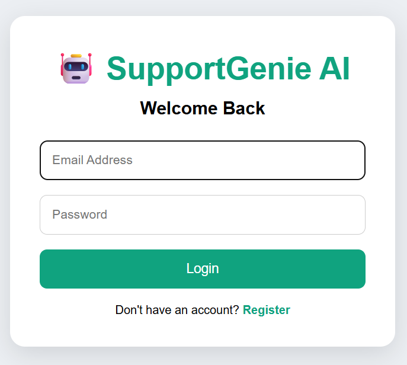
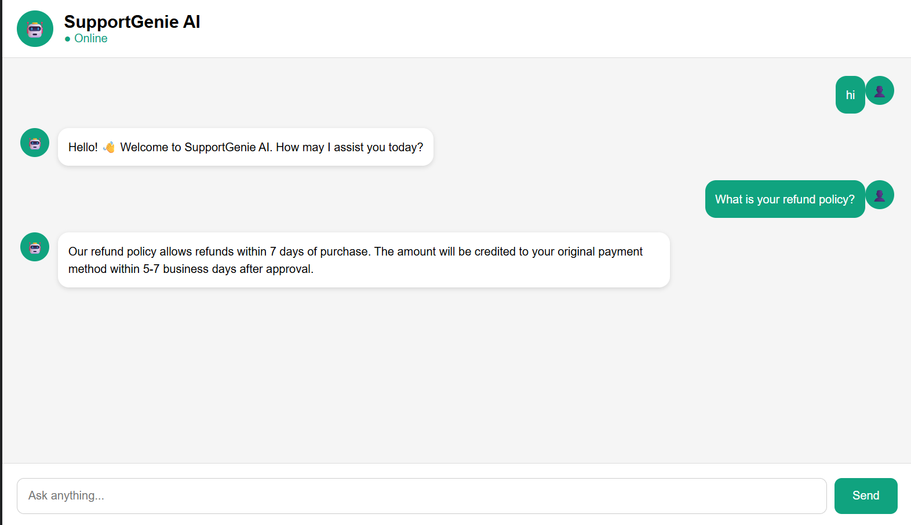
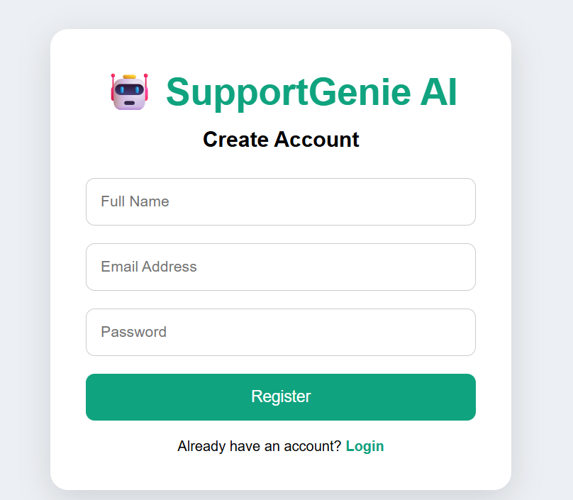

# 🤖 SupportGenie AI

An AI-powered Customer Support Assistant built using **Flask**, **SQLite**, and **Google Gemini API**. The application automates customer support by combining **intent recognition**, **FAQ-based responses**, and **LLM-powered assistance** for handling customer queries.

---

## 🚀 Features

- 🔐 User Registration & Login
- 🤖 AI-powered Customer Support using Google Gemini API
- 🎯 Intent Recognition for Customer Queries
- 📚 FAQ-based Automated Responses
- 💬 Persistent Conversation History
- 📂 Multiple Chat Sessions
- 📊 Dashboard with Chat Statistics
- ⚡ Typing Animation
- 🔎 Conversation Search
- 💾 SQLite Database Integration
- 🔑 Session Management with Flask

---

## 🛠️ Tech Stack

### Backend
- Python
- Flask
- SQLite

### Frontend
- HTML
- CSS
- JavaScript

### AI & APIs
- Google Gemini API
- JSON-based API Communication

---

## 📂 Project Structure

```
SupportGenie-AI/
│
├── app.py
├── auth.py
├── database.py
├── gemini_service.py
├── faq.py
├── intents.py
├── faq.json
├── requirements.txt
├── .env.example
├── README.md
│
├── static/
│   ├── css/
│   ├── js/
│   └── images/
│
├── templates/
│   ├── chat.html
│   ├── login.html
│   ├── register.html
│   └── dashboard.html
│
└── chatbot.db
```

---

## ⚙️ Installation

### Clone the repository

```bash
git clone https://github.com/your-username/SupportGenie-AI.git
cd SupportGenie-AI
```

### Create a virtual environment

```bash
python -m venv venv
```

### Activate the environment

**Windows**

```bash
venv\Scripts\activate
```

**Linux / macOS**

```bash
source venv/bin/activate
```

### Install dependencies

```bash
pip install -r requirements.txt
```

### Create a `.env` file

```
GEMINI_API_KEY=YOUR_GEMINI_API_KEY
SECRET_KEY=YOUR_SECRET_KEY
```

### Run the application

```bash
python app.py
```

The application will be available at:

```
http://127.0.0.1:5000
```

---

## 🏗️ System Architecture

```
User
   │
   ▼
Flask Backend
   │
   ▼
Intent Detection
   │
 ┌───────────────┐
 │               │
FAQ          Gemini API
 │               │
 └───────┬───────┘
         ▼
 SQLite Database
```

---

## 📸 Screenshots

### Login Page



### Chat Interface



### Dashboard



## 💡 Future Enhancements

- Admin Panel
- Feedback System
- Chat Export (PDF)
- Voice Support
- Multi-language Support
- Analytics Dashboard
- Docker Deployment

---

## 📌 Resume Highlights

- Developed an AI-powered customer support chatbot using Google Gemini API.
- Implemented intent recognition with FAQ-based automated responses.
- Built RESTful APIs using Flask with session-based authentication.
- Designed a SQLite-backed conversation management system.
- Integrated JSON-based API communication for AI interactions.

---

## 👩‍💻 Author

**Mahima Patel**

IT Engineering Student | AI & Backend Development Enthusiast

